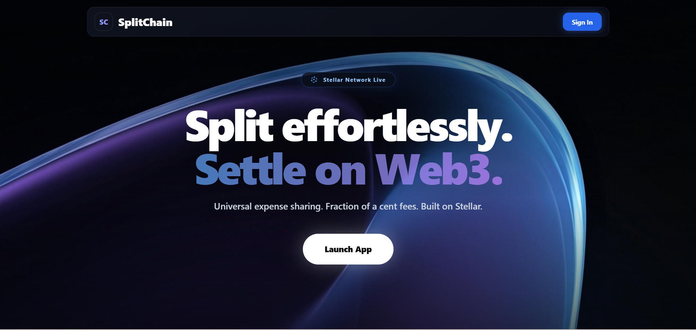
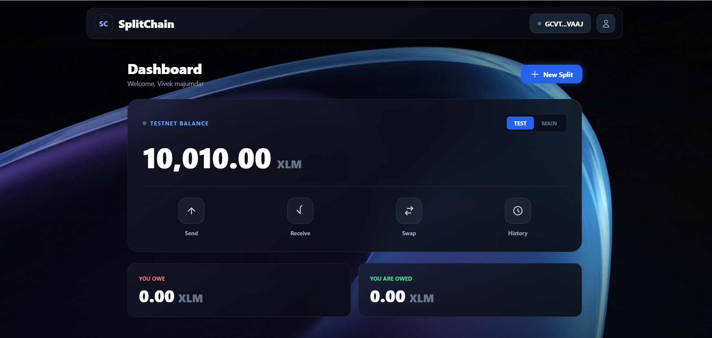
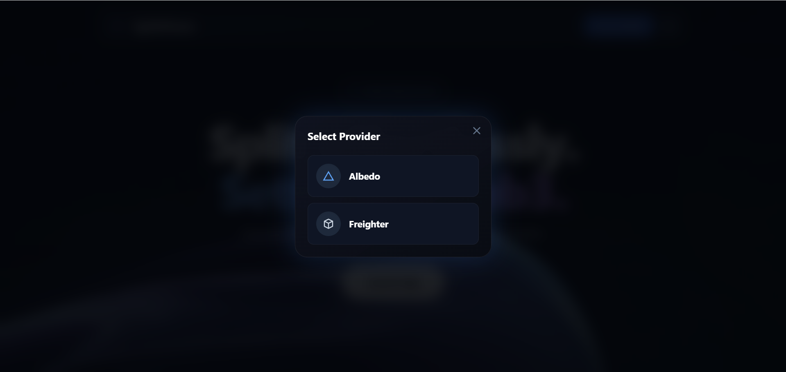
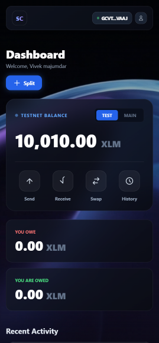

# SplitChain 🌐💸
**A Decentralized Web3 Bill Splitting Application built on the Stellar Blockchain!** 
SplitChain allows you to split bills, share expenses and settle payments trustlessly through Soroban Smart Contracts on Stellar.



---

## Live Demo
( https://split-chain-lemon.vercel.app/ )


## Demo Video
[Watch Full Demo on YouTube](https://youtu.be/pVEo_Xpr6_k?si=IW-4Z2gmdLbwvoVb)


## Contract Information
| Item | Value |
|------|-------|
| Network | Stellar Testnet |
| Contract ID | `CAXE4NUE3NXTKLOWOW5EXUTFL22LUKAFYG6RFKWOYFSRKVYGJHYYQSW5` |
| Deploy TX Hash | `643729a063133e1516859a425e8f2a930759733a08c6980b69af352c1de6549e` |
| Stellar Explorer | [View Contract](https://stellar.expert/explorer/testnet/contract/CAXE4NUE3NXTKLOWOW5EXUTFL22LUKAFYG6RFKWOYFSRKVYGJHYYQSW5) |


## Features
- Soroban Smart Contract escrow for trustless bill splitting
- Albedo & Freighter wallet integration
- Real-time balance display on Stellar testnet
- Transaction history with Stellar Explorer links
- Mobile-responsive UI
- Firebase-backed split group persistence

## Setup Instructions

### Prerequisites
- Make sure you have [Node.js](https://nodejs.org/) installed on your system.
- A Stellar wallet (Albedo or Freighter browser extension)

## ⚙️ How to Run Locally

You can easily run this interface on your own computer:

**Download the Code**: Clone or download this repository.
  
  git clone https://github.com/Vivek-Alpha06/SplitChain.git

 **Start the App**: Open your terminal in the downloaded folder and run:

```bash
cd SplitChain
node server.js
```
Then open http://127.0.0.1:8080 in your browser.


## Architecture
See [ARCHITECTURE.md](ARCHITECTURE.md) for full system design.


## 📸 Screenshots

Here are some pictures of the application in action:

### Balance Displayed



### Wallet Options Available



### Mobile Responsive View


*** For more screenshot check out screenshot folder ***


---


## 5+ User Wallet Addresses (Verified on Stellar Testnet)
| User | Stellar Address |
|------|----------------|
| User 1 | GAQFPTYZEI5RCBURZ7OAMGJYO6NHS7VYWZTNNYEPUOKU7QK5FELPOIYD |
| User 2 | GDU34BU5VFLXSZHM5K4D737TYU6XBATENI5RXCI54UKERV6NITMSWJHT |
| User 3 | GAYUFZJBWTK3T5ZX47DILF43QUGPYFNIPBVTLYLF3CYVJVF54MCSS3G3 |
| User 4 | GCVTL7ISWO52Q5GCOEVZQ5Z77ZN5EFC2N2RNM4IVVVJMILZZ2Q4PVAAJ |
| User 5 | GAJHZLYDEWNHJVG63A3BWAGPHRAR4WQXHRA6QXTBA34MJGGSCRPJWYTP |
| User 6 | GB4EU73SY2J7KJAMTSZCFUER7XKMRUFR3IE3NWDNSFO754EIWUH5ITAB |


## User Feedback
[View User Feedback Document](## User Feedback https://docs.google.com/spreadsheets/d/1OMYjcd8Y0lauWaKeTjOgADurKiF3ZbT3bYKGB098dsw/edit?usp=sharing )

 You can also give feedback(https://docs.google.com/forms/d/e/1FAIpQLScnOGWNPACmkkS-cTpr_IesBMRGntLLBYkIXqzz7M3O60Im8Q/viewform?usp=header).


## CI/CD
This project uses GitHub Actions for automated deployment to Vercel.
Every push to main triggers a build and deploy.


## Tech Stack
- Frontend: React (via SystemJS CDN)
- Smart Contract: Soroban (Rust) on Stellar Testnet
- Backend: Node.js static server
- Wallet: Albedo, Freighter
- Database: Firebase Firestore
- Deployment: Vercel
